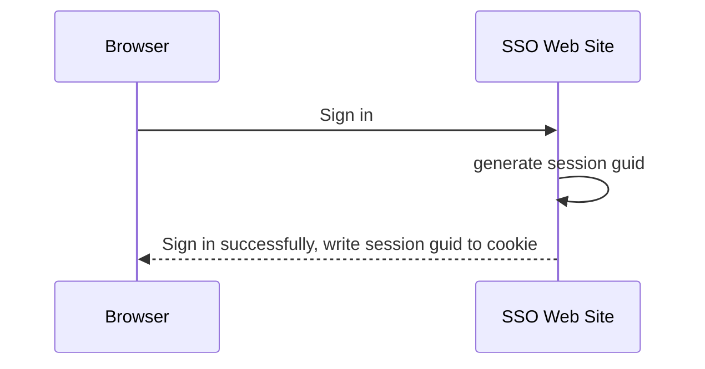
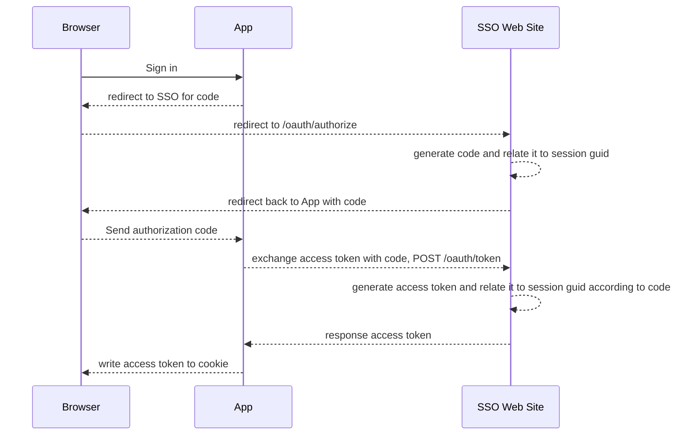
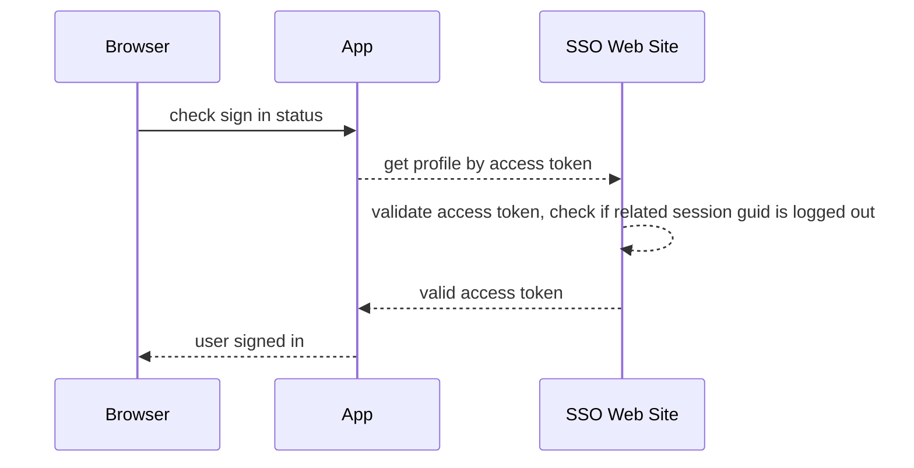
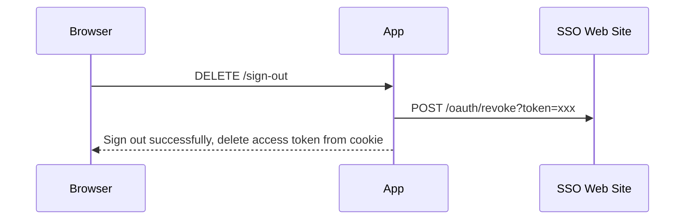
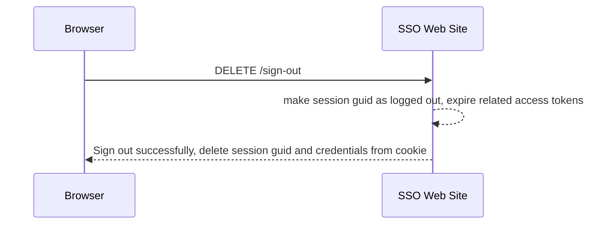

# Doorkeeper SSO

This gem makes Doorkeeper acts as real SSO(Single-Sign-On)/SLO(Single-Log-Out) system. Original doorkeeper can be a SSO system, but it isn't a SLO system, which mean one place logout, another place and Account center still be logged in. With this gem, all places will be logged out.

## Changelog

[CHANGELOG.md](CHANGELOG.md)

## Theory

### Sign in from SSO Web site



### Sign in from SSO Web site to App



### Check sign in status in App



### Sign out from App



### Or sign out from SSO Web Site



## Usage

### requirements

```ruby
gem 'doorkeeper', '~ 5.1'
```

```shell
bundle i
rails g doorkeeper:install
rails g doorkeeper:migration
rake doorkeeper_sso:install:migrations
rails db:migrate
```

### configuration

```ruby
# config/initializers/doorkeeper_sso.rb

# callback: signed in from controller
Doorkeeper::SSO.on_signed_in = ->(controller:, cookies:, session:, sso_session:) {
  puts "-> user signed in: #{sso_session.guid} - #{sso_session.ip_address} - #{sso_session.user_agent}"
}

# callback: signed out from controller
Doorkeeper::SSO.on_signed_out = ->(controller:, cookies:, session:, sso_session:) {
  puts "-> user signed out: #{sso_session.guid}"
}
```

in your session controller, such as `app/controller/sessions_controller.rb'

```ruby
def create
  user = User.from(params[:username], params[:password])
  if user
    Doorkeeper::SSO::Session.sign_in!(self, user: user) do |session:, **_|
      session[:user_id] = user.id
    end
    flash[:notice] = 'signed in successfully!'
    redirect_to home_path
  else
    flash[:alert] = 'invalid email or password'
    render :new
  end
end

def destroy
    Doorkeeper::SSO::Session.sign_out!(self) do |session:, **_|
      session.delete :user_id
    end
    redirect_to root_path
end
```

in current_user helper, we have to check session(Warden/Devise session) and `cookies[Doorkeeper::SSO.cookie_name]`, because a user maybe logged out from API, we just marked `Doorkeeper::SSO::Session#signed_out = true`, do touch cookies.

```ruby
def current_user
  return @current_user if instance_variable_defined?(:@current_user)

  sso_session = Doorkeeper::SSO::Session.from_cookie(cookies)
  user = User.find_by(id: session[:user_id])
  if sso_session && user && sso_session.resource_owner_id == user.id
    @current_user = user
  else
    @current_user = nil
  end
end
```


## Installation
Add this line to your application's Gemfile:

```ruby
gem 'doorkeeper-sso'
```

And then execute:
```bash
$ bundle
```

Or install it yourself as:
```bash
$ gem install doorkeeper-sso
```

## Contributing
Contribution directions go here.

## License
The gem is available as open source under the terms of the [MIT License](https://opensource.org/licenses/MIT).
